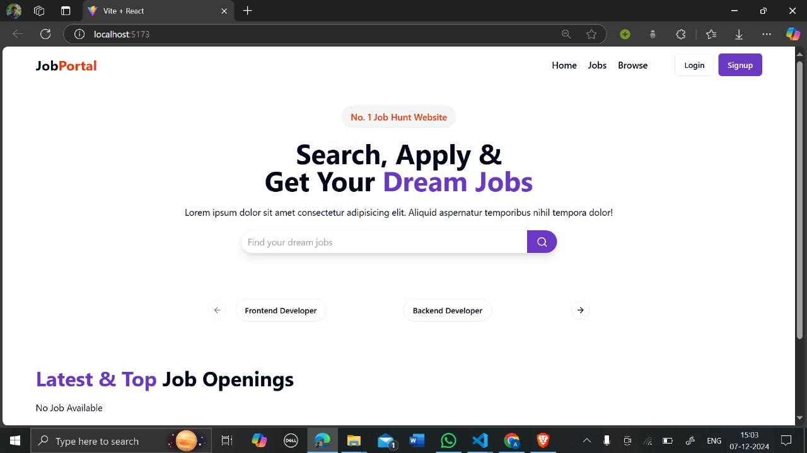
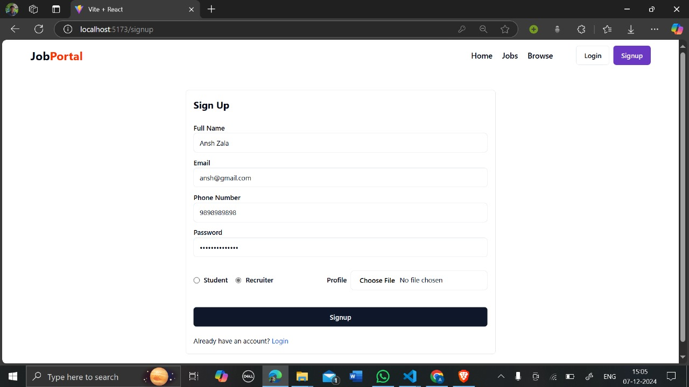
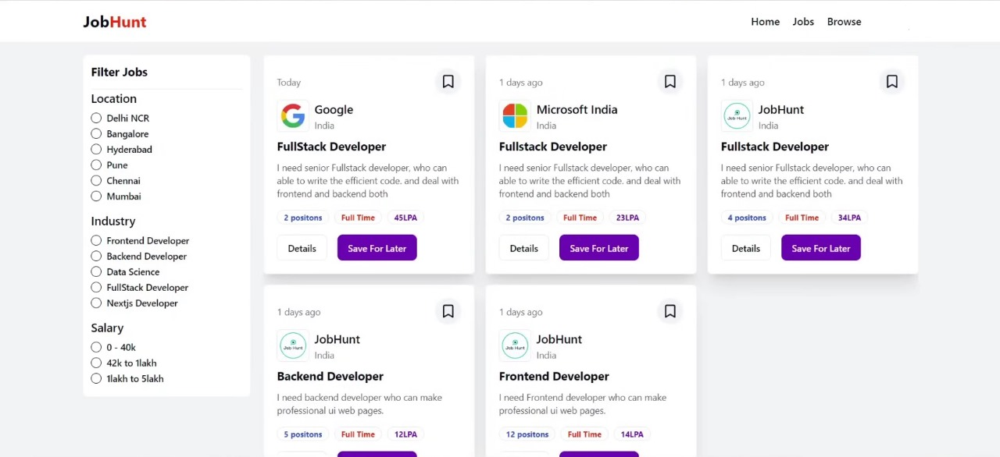
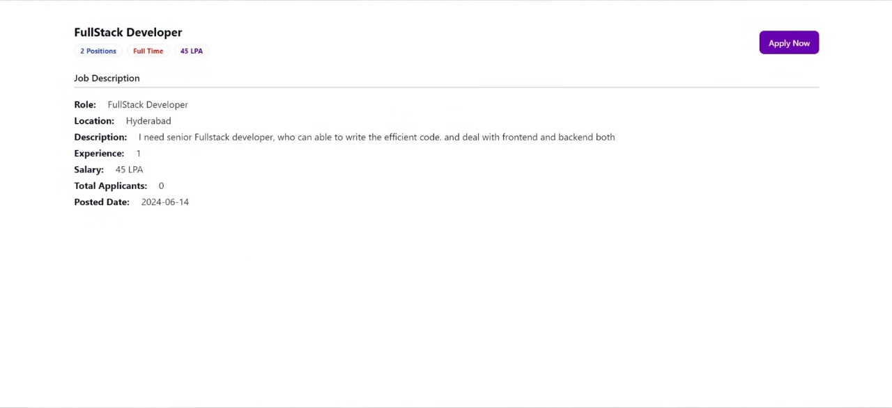

# JobLink 

JobLink Pro is a full-stack web application designed to connect job seekers with employers, streamlining the hiring process. With its user-friendly interface and powerful features, JobLink Pro aims to make job hunting and recruitment efficient and accessible.  

## Features  

### Homepage  
- **Search, Apply & Get Your Dream Jobs**: A clean and intuitive interface with a prominent search bar.  
- **Quick Filters**: Easily navigate job roles such as "Frontend Developer" and "Backend Developer" with predefined categories.  

### Signup Page  
- Separate signup options for **job seekers** and **recruiters**.  
- Fields include name, email, phone number, password, and role selection.  
- Option to upload a profile picture for a personalized experience.  

### Job Hunt & Apply  
- Browse a curated list of job postings tailored to your preferences.  
- Apply directly to jobs with just a few clicks.  
- Detailed job descriptions and recruiter information are available for informed decision-making.  

## Why I Built JobLink Pro  

This project was inspired by the need for a seamless platform that connects job seekers and employers in a meaningful way.  

- **End-to-End Development**: I developed both the front-end and back-end, honing my full-stack development skills.  
- **Impactful Purpose**: Helping people find jobs and employers find the right candidates is a cause close to my heart.  
- **Learning Experience**: It challenged me to learn new technologies and improve my problem-solving skills in real-world scenarios.

## Technologies Used  

- **Frontend**: [React.js ]  
- **Backend**: [Node.js / Express.js]  
- **Database**: [MySQL / MongoDB ]  
- **Hosting**: [Netlify]  

## Screenshots  

### Homepage  
  

### Signup Page  
  

### Job Hunt  
  

### Apply to job
  

